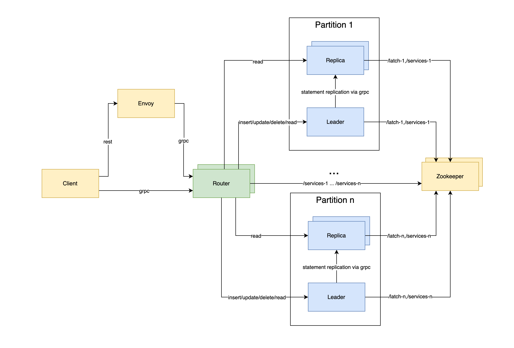

<p align="center">
 	
</p>

# PatrickDB


PatrickDB is a simplified Rust-based database designed to demonstrate distributed database principles. This distributed
key-value store employs Zookeeper for replication and partitioning. Data is stored in a row-based format using a
file-based system.

The database is accessible through gRPC or REST, facilitated by Envoy for converting REST to gRPC. Additionally,
patrick-db's storage and index engines can be integrated into other projects.

# Architecture



Clients compatible with gRPC or REST can connect to patrick-db, such as the [cli](./server/src/client.rs) tool located
in
the [server](./server) directory.

Envoy, which serves multiple purposes, is used here to interchange REST and gRPC.

Zookeeper plays a role in service discovery and managing leader elections.

The [router](server/src/router.rs), a gRPC server akin to the database server, interacts with Zookeeper. It identifies
all partitions and their respective leaders and followers, directing traffic to the appropriate partition through
hash-based partitioning. For write or read operations, it selects the leader, and for read-only operations, a follower
is chosen.

The [database](server/src/server.rs) itself is a gRPC server that implements a file-based storage system. In its role as
a leader, it replicates data to followers using statement replication.

# Getting Started

Start all components (Zookeeper, Envoy, Router, and two Partitions with one Leader and Replica) inside docker
containers:

```bash
make run-all-docker
```

Lint all components:

```bash
make lint
```

Run all tests:

```bash
make test
```
